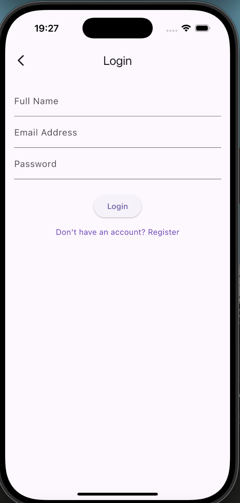
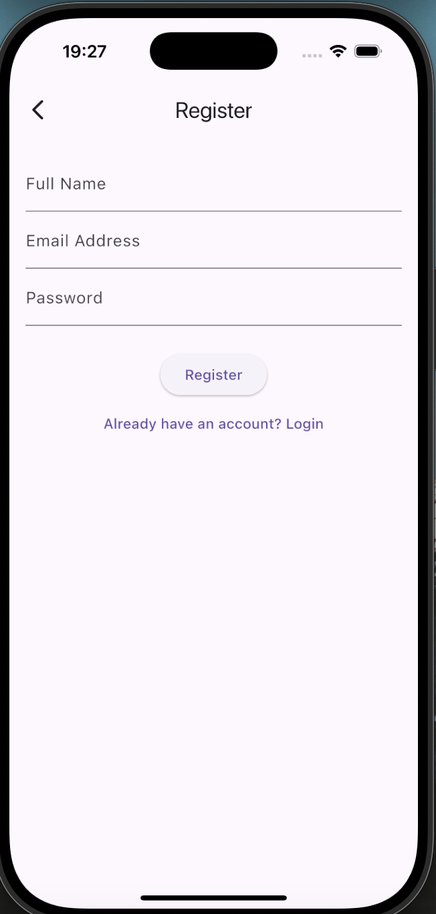
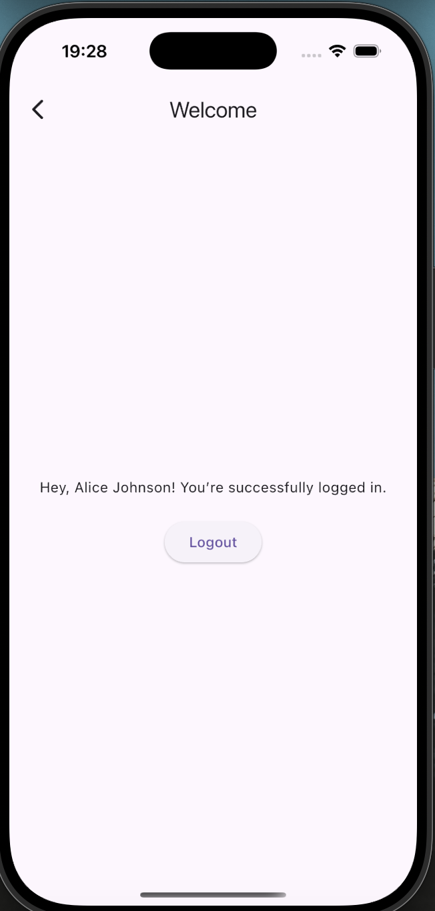

# Flutter Login App with Firebase

A simple Flutter application implementing user login and registration using Firebase Authentication. This project is designed to demonstrate how to create a functional and user-friendly authentication flow in Flutter.


## ✨ Features

- Firebase-based user authentication
- Login & Registration with:
  - Full Name
  - Email Address
  - Password
- Input validation for all fields
- Stores user display name in Firebase
- Greets users by name on login
- Logout functionality that signs out and redirects to login

---

## 📱 Screenshots

<div align="center">
  
  
  
</div>

---

## 🛠 Technologies Used

- [Flutter](https://flutter.dev/)
- [Firebase Authentication](https://firebase.google.com/products/auth)
- [Cloud Firestore](https://firebase.google.com/products/firestore)
- Dart 


## 🚀 Getting Started

### 1. Clone this repo

```bash
git clone https://github.com/nanacode4/Flutter-app.git
cd Flutter-app
````


### 2. Install dependencies

```bash
flutter pub get
```

---

### 3. Configure Firebase

Follow these steps:

1. Go to [Firebase Console](https://console.firebase.google.com/)
2. Create a new project and register your Flutter app (Android/iOS)
3. Enable **Email/Password** under **Authentication → Sign-in method**
4. Enable **Cloud Firestore** and set test mode rules (for development)
5. Download and add Firebase config files:

   * `google-services.json` → `android/app/`
   * `GoogleService-Info.plist` → `ios/Runner/`
6. Generate `firebase_options.dart` using the FlutterFire CLI:

```bash
flutterfire configure
```

---

### 4. Run the app

```bash
flutter run
```

```


